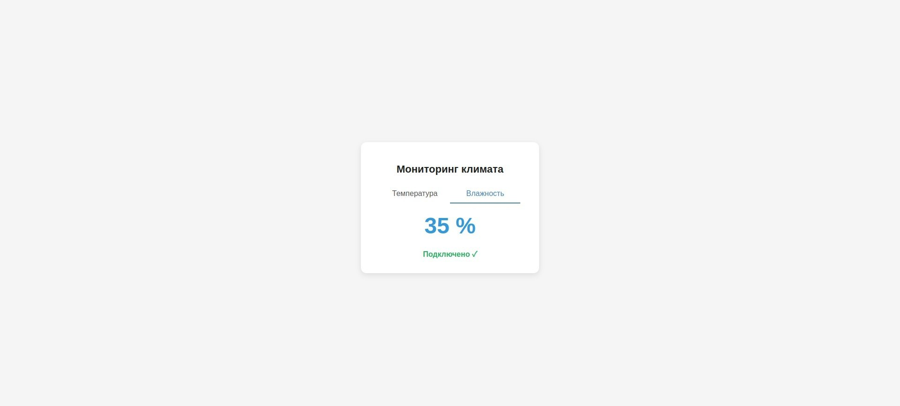
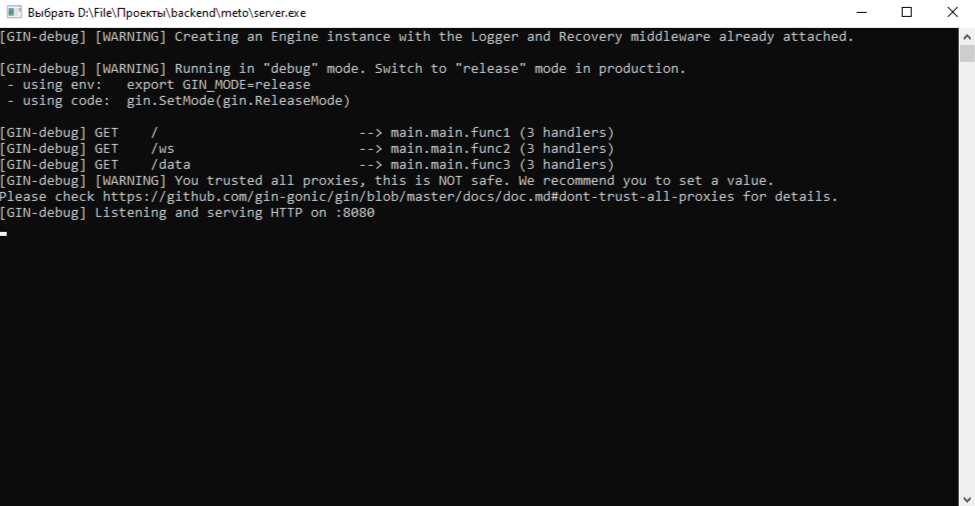

<p align="center">
    
    <br>
    <b>METO</b>
    <br>
    Автоматический клиент-сервер для работы с ESP32
</p>

---

## Содержание
1. [Установка](#установка)
2. [Автоматический установщик](#автоматический-установщик)
3. [Вручную](#вручную)
4. [Сайт](#сайт)
5. [Эндпоинты](#эндпоинты)
6. [Пример консоли](#пример-консоли-работы-сервера)

---

## Установка
Скачайте [установщик](https://github.com/myn1c/meto/releases/tag/installer) или проект.

---

## Автоматический установщик

Пример работы `installer.go`:

```text
Это автоматический настройщик клиентской части meto
Введите название сети ESP: Ufanet
Введите пароль от сети: Password
Введите порт (по умолчанию 8080): 
Введите IP host (по умолчанию локальный IP пк в сети): 

Название сети: Ufanet
Пароль: Password
Порт: 8080
Хост: 169.254.142.85
Скачиваем клиентский файл: https://raw.githubusercontent.com/myn1c/meto/main/src/client_esp32.py
Файл client_esp32.py успешно создан!
Скачать сервер? (y/n): y

Получаем список релизов сервера с GitHub...

Превышен лимит запросов к GitHub.
Чтобы продолжить, нужно ввести Personal Access Token (PAT).
Инструкция:
1. Зайди на https://github.com/settings/tokens
2. Developer settings → Personal access tokens → Tokens (classic) → Generate new token
3. Для чтения релизов публичных репозиториев достаточно любого токена
Введите токен: g#p#DOALP0#jK#R####Sjx#n##bX9##b3##8yp7

Найденные серверные релизы:
[1] windows
[2] kubuntu
Выберите номер релиза для скачивания: 1
Скачиваем server-Windows.exe
Сервер сохранён: server-Windows.exe
Запустить сервер? (y/n): y
[GIN-debug] [WARNING] Creating an Engine instance with the Logger and Recovery middleware already attached.

[GIN-debug] [WARNING] Running in "debug" mode. Switch to "release" mode in production.
 - using env:	export GIN_MODE=release
 - using code:	gin.SetMode(gin.ReleaseMode)

[GIN-debug] GET    /                         --> main.main.func1 (3 handlers)
[GIN-debug] GET    /ws                       --> main.main.func2 (3 handlers)
[GIN-debug] GET    /data                     --> main.main.func3 (3 handlers)
````

---

## Вручную

Если хотите настроить клиент вручную, замените переменные в `client_esp32.py`:

```python
SSID = "Название сети"
PASS = "Пароль сети"

API_HOST = "ip хоста"
API_PORT = порт
```

IP хоста можно узнать с помощью:

```python
import socket

def get_local_ip():
    s = socket.socket(socket.AF_INET, socket.SOCK_DGRAM)
    try:
        s.connect(("8.8.8.8", 80))
        return s.getsockname()[0]
    except:
        return None
    finally:
        s.close()

print("IP:", get_local_ip())
```

Команда для запуска сервера на Linux:

```bash
./server
```

---

## Сайт

Сайт будет выглядеть примерно так по пути `/`:

<p align="center">
    
</p>

---

## Эндпоинты

* `../` — возвращает главную страницу
* `../data/` — добавление изменений (temp="температура", humidity="влажность")

---

## Пример консоли работы сервера

<p align="center">
    
</p>

